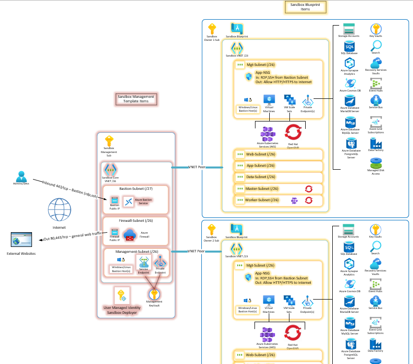

# Azure Landing Zones for MAG 
Azure Landing Zones are the output of a multi-subscription Azure environment that account for scale, security, governance, networking, and identity. Azure landing zones enable application migrations and greenfield development at enterprise scale in Azure. These zones consider all platform resources that are required to support the customer's application portfolio and don't differentiate between infrastructure as a service or platform as a service.  It is recommended to begin with the most current version of the Cloud Adoption Framework (CAF) aligned Enterprise Scale Landing Zone reference architectures to ensure a comprehensive and repeatable approach with guidance and templates.
* [CAF Aligned Enterprise Scale Landing Zones](https://docs.microsoft.com/en-us/azure/cloud-adoption-framework/ready/landing-zone/)
* [Training Path for Enterprise Scale Architectures](https://docs.microsoft.com/en-us/learn/paths/enterprise-scale-architecture/)
* [Cloud Adoption Framework (CAF) Information](https://docs.microsoft.com/en-us/azure/cloud-adoption-framework/)
* [Training Path for CAF](https://docs.microsoft.com/en-us/learn/modules/microsoft-cloud-adoption-framework-for-azure/) 
* [Enterprise Scale ARM Deployment Artifacts on GitHub](https://github.com/Azure/Enterprise-Scale)
* [Enterprise Scale Terraform Deployment Artifacts on GitHub](https://github.com/azure/caf-terraform-landingzones)

The solutions contained in this repository extend the base CAF aligned architectures referenced above to include instructions for deploying them to Microsoft Azure Government (MAG) environments.  In addition, this repo contains user landing zones and additional enterprise service templates which can be deployed within the Enterprise Scale Architecture to enable additional hosting and management scenarios.

## Steps

1. Deploy Enterprise Landing Zone
2. Deploy User Landing Zone(s) 
3. Deploy Enterprise Services

## Step 1 - Deploying Enterprise-scale Landing Zone
The **Enterprise Scale Landing Zone** should be deployed first to create the overall cloud management structure and governance for the hosting environment.  This includes the management group hierarchy, policies, connectivity, and management components needed to centrally administer the entire environment.  Landing Zones are deployed using Blueprints or with custom Azure Resource Manager (ARM) or Terraform templates.  It is recommended to use the most current CAF Enterprise Scale Landing Zone templates as a starting point for the organization and then adjust based on requirements.  The public source repositories for these templates should be checked into the organizational source control, then managed and deployed through a CICD pipeline using Infrastructure-as-Code.  The organziational platform team will then be responsible for managing the Enterprise Scale Landing zone using build and release process automation to make configuration changes to the environment.  The following diagram depicts a high level enterprise scale landing zone you can deploy with the solution:

The Enterprise Landing Zone template is available [HERE](templates/entlz).  

## Step 2 - Deploy App Landing Zones
Select a scenario:
* [Deploy Sandbox Landing Zone](templates/applz/sandbox)
* [Deploy FedRAMP Moderate App Landing Zone](templates/applz/fedrampmod)

Once the Enterprise Scale Landing Zone is deployed the organization can onboard Application development teams into the environment using **User Landing Zone** templates.  User Landing Zones setup and enforce the required policy, compliance and connectivity components within the app owner's subscription which allows them to rapidly begin development activities in a secure fashion.  The following diagram depicts a Sandbox User Landing Zone solution deployed within the Enterprise Scale framework to support development activities:

Another example of User Landing Zone could be a new subscription with pre-built accreditation policies enforced via Blueprint.  These exists for the following accreditation frameworks in the Azure Government (MAG) GCC High environment.
* [FedRAMP Moderate](https://docs.microsoft.com/en-us/azure/governance/blueprints/samples/fedramp-m/)
* [FedRAMP High](https://docs.microsoft.com/en-us/azure/governance/blueprints/samples/fedramp-h/)
* [DoD Impact Level 4 (IL4)](https://docs.microsoft.com/en-us/azure/governance/blueprints/samples/dod-impact-level-4/)
* [DoD Impact Level 5 (IL5)](https://docs.microsoft.com/en-us/azure/governance/blueprints/samples/dod-impact-level-5/)
* [NIST SP 800-171 R2](https://docs.microsoft.com/en-us/azure/governance/blueprints/samples/nist-sp-800-171-r2)
* [NIST SP 800-53 R4](https://docs.microsoft.com/en-us/azure/governance/blueprints/samples/nist-sp-800-53-r4)

In the diagram below the solution is used to deploy a user landing zone within the Enterprise Scale framework with FedRAMP Moderate policies stamped on the subscription during deployment:

## Step 3 - Deploy Additional Enterprise Services
Select a scenario:
* [Active Directory Zonal Deployment](templates/entsvcs/active-directory-new-domain-ha-2-dc-zones/)
* [Red Hat OpenShift Private Cluster Deployment on MAG](templates/entsvcs/openshift/README.md)
* [DISA STIG Image Factory on MAG](templates/entsvcs/stig-image-factory/README.md)
* [Burst Rendering on MAG](templates/entsvcs/burst-rendering/README.md)

In addition to Enterprise Scale and User Landing Zones this repository also contains solutions for additional **Enterprise Services** which often are needed to support various hosting requirements.  These may include additional identity integration, management and security solutions required by the enterprise. 

# Additional Resources
## Microsoft Well-Architected Framework
The Azure Well-Architected Framework is a set of guiding tenets that can be used to improve the quality of a workload. The framework consists of five pillars of architecture excellence: Cost Optimization, Operational Excellence, Performance Efficiency, Reliability, and Security.  See https://docs.microsoft.com/en-us/azure/architecture/framework/.

 

